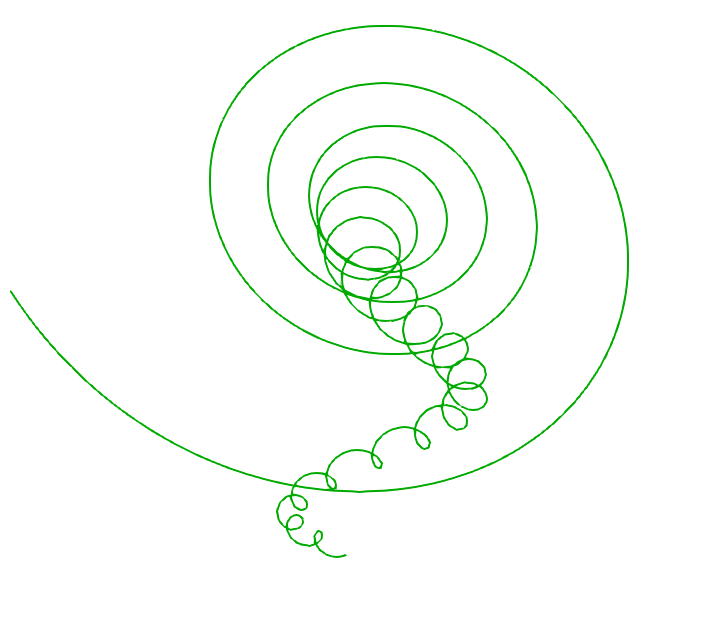

# CS661 Assignment 3 Group 24
24_241110035_241110089_Assignment3

Khushwant Kaswan - 241110035 - khushwantk24@iitk.ac.in

Senthil Ganesh - 241110089 - senthil24@iitk.ac.in

---


1. Install libraries:
   ```bash
   pip install vtk numpy
   ```

#### **Usage**
```bash
python3 A3.py <x_val> <y_val> <z_val> <yes/no>
```

#### Output : streamline.vtp

#### **Parameters**
- `x_val`,`y_val`,`z_val`: Seed point (x,y,z)
- yes/no: Vizulaize the output generated. (default value : no)

#### **Example**
```bash
python3 A3.py 0 0 7 yes
```

```bash
python3 A3.py 0 0 7
```

```bash
python3 A3.py 0 0 7 no
```

#### ParaView Visualization
- Change colur to green
- Change background colour to White
- Change linewidth as needed

ParaView Vizualization images attached in images folder.



